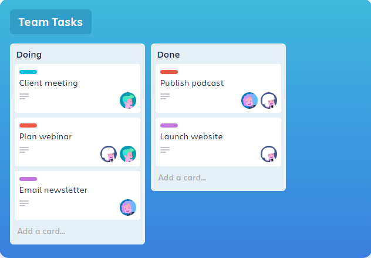

# react-hooks-trello-board

The app is orginally from react dnd github which is archived now. I took a chance to refactored this app using Hooks as part of my learning excercise.

Trello lets you work more collaboratively and get more done.
Trello’s boards, lists, and cards enable you to organize and prioritize your projects in a fun, flexible, and rewarding way.

# See how it works

Go from idea to action in seconds with Trello’s intuitively simple boards, lists, and cards.

#### view demo here.

https://khanzzirfan.github.io/react-hooks-trello-board/

# Trello your way

Use Trello the way your team works best. We’ve got the flexibility & features to fit any team’s style.

